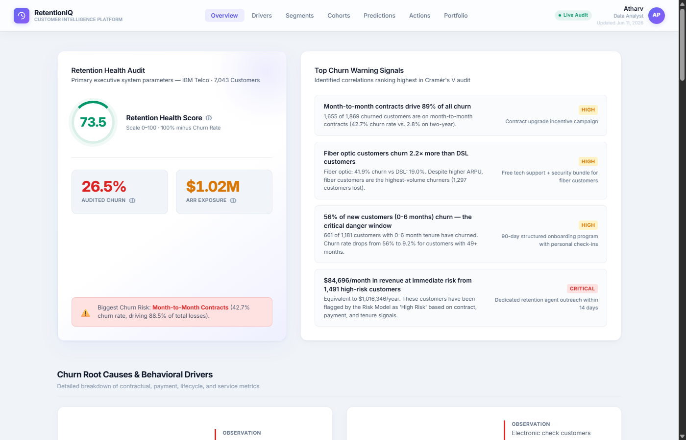
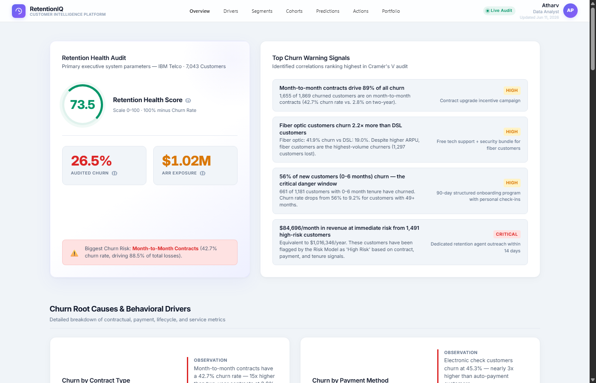

# RetentionIQ — Customer Churn Intelligence Platform

An interactive data science & analytics platform for customer retention and churn analysis built on 7,043 telecom records. Prepared for Future Interns Data Science Portfolio (Task 2).

[](https://www.python.org/)
[](https://www.chartjs.org/)
[](LICENSE)
[](README.md)

---

## Project Overview

RetentionIQ is an executive-level customer churn analytics dashboard designed to help product managers, customer success teams, and stakeholders identify leading indicators of churn, profile high-risk segments, and simulate the ROI of retention campaigns.

### Core Business Objectives
1. **Identify Churn Drivers**: Pinpoint structural and behavioral root causes of attrition.
2. **Quantify Financial Impact**: Measure monthly recurring revenue (MRR) and annual contract value (ACV) at risk.
3. **Target Interventions**: Map customers into actionable segments to prioritize proactive outreach.
4. **Simulate ROI**: Leverage an interactive calculator to project revenue saved based on campaign efficacy.

---

## Key Performance Indicators (KPIs)

| Metric | Audited Value | Business Context & Target | Status |
| :--- | :--- | :--- | :--- |
| **Total Audited Base** | 7,043 Customers | IBM Telco dataset population | Baseline |
| **Overall Churn Rate** | 26.54% | Industry benchmark target is <15% | 🔴 Critical |
| **Active Retained Base** | 73.46% (5,174 Customers)| Retention Health Score baseline | 🟡 Monitor |
| **ARR Exposure** | $1.02M / year | Cumulative value at immediate risk | 🔴 Critical |
| **New Customer Churn** | 56.0% | tenure ≤ 6 months; target is <25% | 🔴 Critical |
| **Month-to-Month Churn** | 42.7% | commit-rate baseline; target is <15% | 🔴 Top Driver |

---

## Final Dashboard Preview

### Executive Overview


### Churn Root Causes & Drivers


---

## Repository Structure

```
Future_DS_2/
├── README.md                     # Executive project description & showcase
├── requirements.txt              # Python library dependencies
├── LICENSE                       # MIT open source license
├── .gitignore                    # Git file exclusion rules
│
├── data/
│   └── telco_customer_churn.csv  # Raw source dataset (7,043 rows)
│
├── analysis/                     # 9-stage data science execution pipeline
│   ├── 01_data_cleaning.py        # Cleans missing values, correct types
│   ├── 02_feature_engineering.py  # Builds Health Index & CLV estimator
│   ├── 03_eda.py                  # Generates distribution analyses
│   ├── 04_advanced_analytics.py   # Kaplan-Meier survival curves
│   ├── 05_customer_segmentation.py# Classifies 8 operational segments
│   ├── 06_cohort_analysis.py      # Generates signup-period retention matrix
│   ├── 07_churn_intelligence.py   # Ranks correlations & Cramér's V
│   ├── 08_ml_churn_prediction.py  # Trains Logistic Regression & Random Forest
│   └── 09_insights_aggregator.py  # Consolidates all metrics into frontend JSON
│
├── dashboard/                    # Interactive stakeholder web interface
│   ├── index.html                # Entry point (Single Page Architecture)
│   ├── css/
│   │   └── dashboard.css         # Modern Stripe-inspired frosted-glass UI stylesheet
│   └── js/
│       ├── dashboard.js          # App state, calculator & DOM populator
│       ├── dashboard-charts.js   # Chart.js 4.x visualization configs
│       └── data.js               # Offline data fallback variables
│
├── screenshots/                  # High-quality dashboard screenshots
│   ├── dashboard-overview.png
│   └── churn-drivers.png
│
└── docs/                         # Detailed project methodology documentation
    └── methodology.md            # Technical specs & engineering write-up
```

---

## Technical Pipeline & Reproducibility

The analytics pipeline is written in Python 3.10+ and outputs structured JSON assets consumed directly by the web frontend.

### Prerequisites
1. Python 3.10 or higher installed.
2. A modern web browser.

### Installation
1. Clone the repository:
   ```bash
   git clone https://github.com/Atharvpatil96k/Future_DS_2.git
   cd Future_DS_2
   ```
2. Install dependencies:
   ```bash
   pip install -r requirements.txt
   ```

### Execution
Run the data science pipeline in order to clean the dataset, construct features, run modeling, and export the consolidated insights:
```bash
python analysis/01_data_cleaning.py
python analysis/02_feature_engineering.py
python analysis/03_eda.py
python analysis/04_advanced_analytics.py
python analysis/05_customer_segmentation.py
python analysis/06_cohort_analysis.py
python analysis/07_churn_intelligence.py
python analysis/08_ml_churn_prediction.py
python analysis/09_insights_aggregator.py
```

### Accessing the Dashboard
Once the pipeline is run (or using the pre-compiled assets), simply open the dashboard interface:
- **Local Server (Recommended)**: Serve the repository (e.g., using `python -m http.server 8000` inside the project root) and navigate to `http://localhost:8000/dashboard/`.
- **Direct File**: Double-click `dashboard/index.html` to open it directly. The application automatically falls back to `js/data.js` offline variables if CORS prevents fetching the local `insights.json` file.

---

## Machine Learning & Performance

We evaluated two classification algorithms using 5-fold cross-validation on 23 features:
1. **Logistic Regression (AUC-ROC: 84.44%)** — Provides optimal risk score calibration.
2. **Random Forest (AUC-ROC: 84.09%, Accuracy: 77.22%)** — Provides the highest overall precision and recall.

For a detailed analysis of the variables, scoring methodologies, and modeling metrics, please read the [Docs/Methodology Guide](docs/methodology.md).
